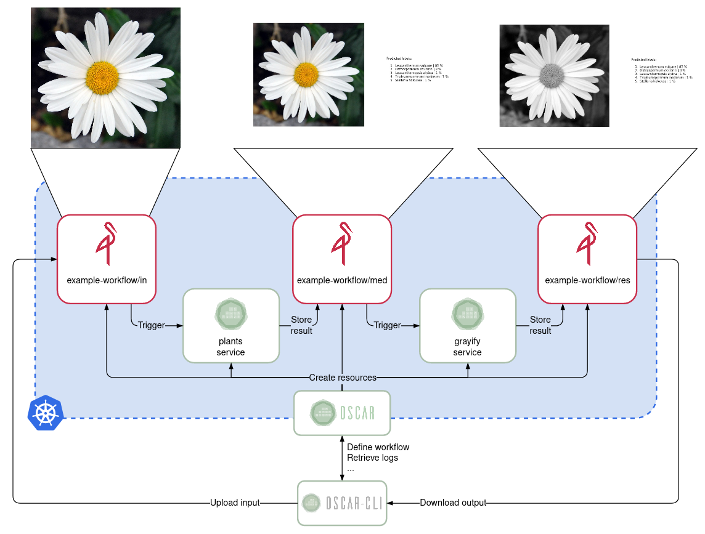

# Example workflow

This workflow is composed by the [plant-classification](https://github.com/grycap/oscar/tree/master/examples/plant-classification-theano) and the [grayify (ImageMagick)](https://github.com/grycap/oscar/tree/master/examples/imagemagick) examples.



In the `example-workflow.yaml` file you can find the definition of the two OSCAR services and its connection via a MinIO bucket. As can be seen, the identifier used for the OSCAR cluster in the workflow definition is `oscar-test`, so firstly you must add a pre-deployed cluster (deployment instructions can be found [here](https://grycap.github.io/oscar)) with the same identifier (or change the identifier in the definition file):

```
echo $MY_PASSWORD | oscar-cli cluster add oscar-test https://my-oscar.cluster my-username --password-stdin
```


Note that the user-script files are under the same folder, so to correctly apply the workflow you must be in the `example-workflow` directory:

```
cd example-workflow
oscar-cli apply example-workflow.yaml
```

Now, you can check that the two services are successfully deployed by running:

```
oscar-cli service list
```

And, to trigger the execution of the workflow, you can upload the `input-image.jpg` file to the `in` folder in the `example-workflow` MinIO bucket:

```
oscar-cli service put-file plants minio.default input-image.jpg example-workflow/in/image.jpg
```

To check that the service has been successfully invoked and a Kubernetes job has been created, you can run:

```
oscar-cli service logs list plants
```

You can also retrieve the logs from a service's job with:

```
oscar-cli service logs get plants JOB_NAME
```

Once the job has finished, its status will change to "Succeeded" and an output file will be uploaded to the `med` folder in the `example-workflow` MinIO bucket, triggering the grayify service. You can check the logs as in the previous steps, only changing the service name.

Finally, when the grayify service's job ends the execution, the result of the workflow will be stored in the `res` folder of the same bucket. You can download the resulting file by executing:

```
oscar-cli service get-file grayify minio.default example-workflow/res/image.jpg result.jpg
```